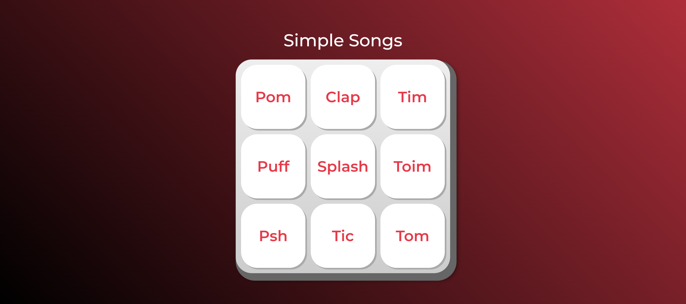

# Simple_songs



Eu fiz <strong>apenas</strong> a parte JS, as outras partes foram de autoria da "Alura Cursos" (=> https://cursos.alura.com.br/)

## Ferramentas utilizadas:

* Java Script

* Visual Studio Code

## Feito por:

### Davi Castro:

### Linkedin: https://www.linkedin.com/in/davi-castro-c/

```

